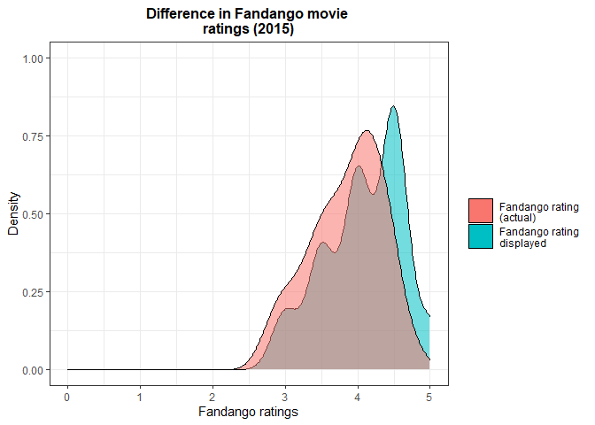
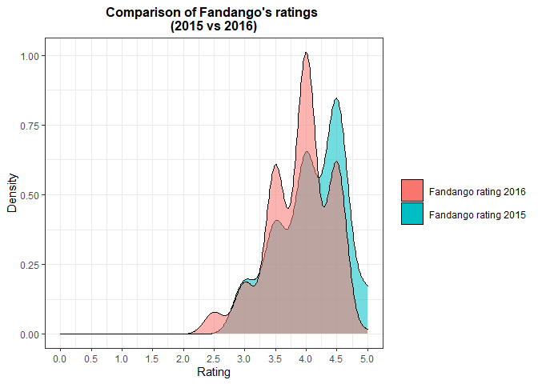

Guided Project: Analyzing Fandango
================
Fredrick Boshe
04/05/2021

Branching off one of the famous movie rating analysis that was done on
Fandango by the brilliant
[FiveThirtyEight](https://fivethirtyeight.com/features/fandango-movies-ratings/)
(done by Walt Hickey), this project looks to analyze recent movie
ratings. This is a visualization project employing different frequency
visualization charts.

This project will use two sets of data, *before* Walt Hickey’s analysis
and *after* his analysis. Thankfully, Walt made his data public on his
[Github](https://github.com/fivethirtyeight/data/tree/master/fandango)
(2015) while another Github user, Mircel, shared
[data](https://github.com/mircealex/Movie_ratings_2016_17) post the
analysis (2016-2017).

## Import and examine data

``` r
#Load data from your working directory
#Select fandago variables only
pre_fandago<-pre%>%
  select(1,7,8, 21, 22)

post_fandago<-post%>%
  select(1,2,7)
```

From Hickey’s article and from the README.md of [the data set’s
repository](https://github.com/fivethirtyeight/data/tree/master/fandango),
we can see that he used the following sampling criteria:

-   The movie must have had at least 30 fan ratings on Fandango’s
    website at the time of sampling (Aug. 24, 2015).
-   The movie must have had tickets on sale in 2015.

The sampling was clearly not random because not every movie had the same
chance to be included in the sample — some movies didn’t have a chance
at all (like those having under 30 fan ratings or those without tickets
on sale in 2015). It’s questionable whether this sample is
representative of the entire population we’re interested to describe. It
seems more likely that it isn’t, mostly because this sample is subject
to temporal trends — e.g. movies in 2015 might have been outstandingly
good or bad compared to other years.

The sampling conditions for our other sample were (as it can be read in
the README.md of [the data set’s
repository](https://github.com/mircealex/Movie_ratings_2016_17)):

-   The movie must have been released in 2016 or later.
-   The movie must have had a considerable number of votes and reviews
    (unclear how many from the README.md or from the data).

Isolating the Samples We Need With this new research goal, we have two
populations of interest:

1.  All Fandango’s ratings for popular movies released in 2015.
2.  All Fandango’s ratings for popular movies released in 2016.

``` r
#generate year column from film column
pre_fandago<-pre_fandago%>%
  separate(FILM,
           into=c("Film", "Year"),
           sep="\\(")
pre_fandago$Year<-parse_number(pre_fandago$Year)

#remain with only movies released in 2015 for pre dataset
pre_fandago<-pre_fandago%>%
  filter(Year==2015)

#remain with only 2016 movies in post dataset
post_fandago<-post_fandago%>%
  filter(year==2016)
```

## Analysis

``` r
#Plot 2015
plot1<-pre_fandago%>%
  ggplot()+
  geom_density(aes(x=Fandango_Stars, fill="red", alpha=0.5))+
  geom_density(aes(x=Fandango_Ratingvalue, fill="blue", alpha=0.5))+
  guides(alpha=FALSE)+
  theme_bw()+
  scale_x_continuous(name="Fandango ratings", limits = c(0,5))+
  scale_y_continuous(name="Density", limits = c(0.0,1.0))+
  scale_fill_discrete(name = "", labels = c("Fandango rating \n(actual)", 
                                            "Fandango rating \ndisplayed"))+
  labs(title = "Difference in Fandango movie \nratings (2015)")+
  theme(plot.title = element_text(hjust=0.5, size = 12, face="bold"),
        legend.key.size = unit(1.5, 'lines'))
plot1
```



``` r
#Compare displayed ratings 2015vs 2016
plot2<-ggplot(data = pre_fandago, 
       aes(x = Fandango_Stars, fill="Red", alpha=0.5)) +
  geom_density() +
  geom_density(data = post_fandago, 
               aes(x = fandango, fill= "blue", alpha=0.5)) +
  guides(alpha=FALSE)+
  theme_bw()+
  labs(title = "Comparison of Fandango's ratings \n(2015 vs 2016)",
       x = "Rating",
       y = "Density") +
  scale_x_continuous(breaks = seq(0, 5, by = 0.5), 
                     limits = c(0,5))+
   scale_fill_discrete(name = "", labels = c("Fandango rating 2016",
                                             "Fandango rating 2015"))+
  theme(plot.title = element_text(hjust=0.5, size = 12, face="bold"),
        legend.key.size = unit(1.5, 'lines'))
plot2
```



It is clear that in 2015 Fandango were overbloating their ratings.
Actual ratings were lower than the ratings displayed on their website.
After being called out and questioned, they attributed it to a bug and
promised to sort it out.

Comparing the displayed ratings for 2016 movies vs 2015 movies, it seems
that the 2016 displayed ratings have subsided. This shows there could
have been a tweak and current ratings might reflect actual ratings.

``` r
pre_fandago %>% 
  group_by(Fandango_Stars) %>% 
  summarize(Percentage = n() / nrow(pre_fandago) * 100)
```

    ## # A tibble: 5 x 2
    ##   Fandango_Stars Percentage
    ##            <dbl>      <dbl>
    ## 1            3         8.53
    ## 2            3.5      17.8 
    ## 3            4        28.7 
    ## 4            4.5      38.0 
    ## 5            5         6.98

``` r
post_fandago %>% 
  group_by(fandango) %>% 
  summarize(Percentage = n() / nrow(post_fandago) * 100)
```

    ## # A tibble: 6 x 2
    ##   fandango Percentage
    ##      <dbl>      <dbl>
    ## 1      2.5      3.14 
    ## 2      3        7.33 
    ## 3      3.5     24.1  
    ## 4      4       40.3  
    ## 5      4.5     24.6  
    ## 6      5        0.524

The Percentage of movies that displayed 4.5 and 5.0 stars really went
down in 2016 as compared to 2015. Further proving the shift lower in
ratings.

### Conclusion

Fandango have been able to revise how they calculate and display fan
rating of the movies on their website. Initially, it would seem they
over estimated ratings in efforts to boost ticket sales (they sell movie
tickets).
