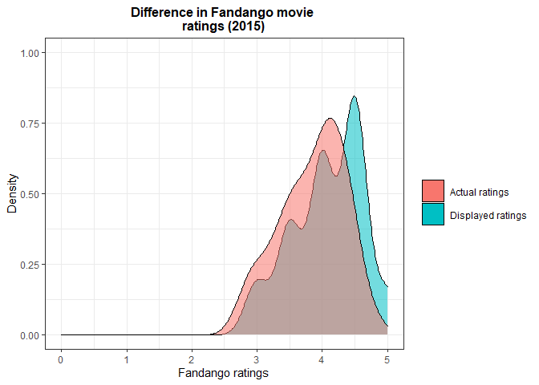
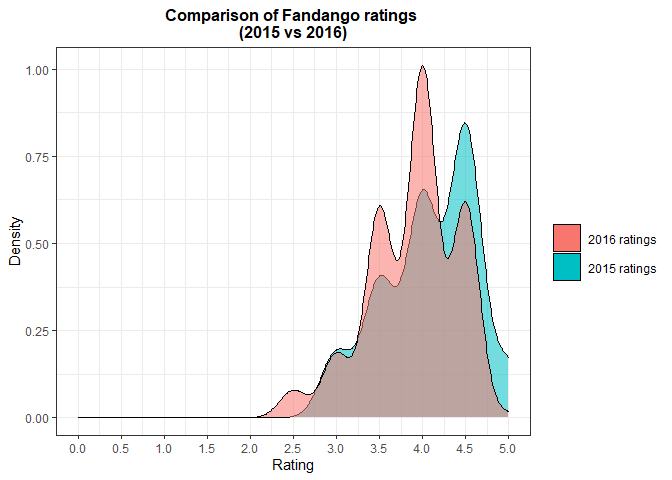
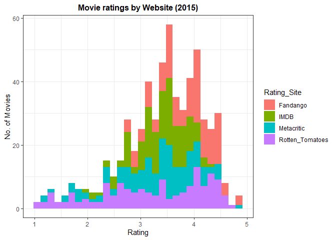
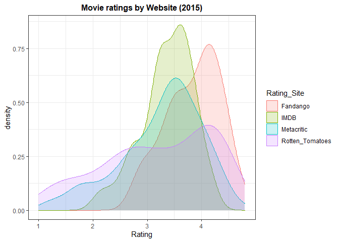

Guided project: Analyzing Movie Ratings
================
Fredrick Boshe
01/05/2021

Most of us love watching good movies that align to our tastes and at
times, well-rated ones. We can either allow streaming platforms to
recommend us movies, see trailers and get interested in upcoming movies
or like most of us, go through rating sites like
[IMDB](https://www.imdb.com/?ref_=nv_home) or
[Fandango](https://www.fandango.com/).

The problem is, not all rating sites rate movies the same and we do not
know how sites score movies. We would like to rely on sites that are
fair, transparent and consistent in how they rate movies. As an analyst,
looking at rating data, exploring and visualizing it, helps provide
valuable insights.

This project looks into two key areas when it comes to analyzing movie
rating data: 1. How do we gain access to movie rating data? **Goal:**
Extract, clean and explore movie rating data. 2. How do we analyze a
site’s transparency and consistency in rating movies? **Goal:** Explore
movie ratings and visualize annual ratings.

## Movie ratings: Sourcing Data

Most movie rating websites contain a multitude of data from images, to
texts to numbers (e.g. scores, year of release etc). I shall use web
scarping techniques to extract details of the [“Best British TV
2021”](https://www.imdb.com/list/ls086566770/). I love British tv shows
so i will attempt to extract their *titles*, *year*, *run-time*,
*genre*, *number of votes* and *rating*.

This example contains some missing values, just like most data we come
across in the world, so it will serve as a good example on how to first
scrap the web, the clean the data and eventually manipulate it to deal
with missing values.

``` r
#Load require packages. Important "rvest" for web scraping.
library(tidyverse)
library(rvest)
library(httr)
library(ggplot2)
library(gridExtra)
```

When web scraping, it is always important to be able to identify the
path/CSS selectors of the object e.g. image, you want to capture. Some
people prefer to use the “Inspect Webpage” option when you right click
on a webpage. Another cool tool, that i prefer to use, is the chrome
extension,
[SelectorGadget](https://chrome.google.com/webstore/detail/selectorgadget/mhjhnkcfbdhnjickkkdbjoemdmbfginb?hl=en).

``` r
#Scrap the webpage and clean respective fields.
wp_content_titles<-read_html("C:/Users/ricky/Documents/GitHub/misc-projects/Best British TV 2021 - IMDb.html")%>%
  html_nodes(".sub-list h3 a")%>% #This is the selector to show titles
  html_text() #this specifies the output, "text", i am seeking

wp_content_year<-read_html("C:/Users/ricky/Documents/GitHub/misc-projects/Best British TV 2021 - IMDb.html")%>%
  html_nodes(".sub-list h3 span:nth-child(3)")%>%
  html_text()
wp_content_year<-parse_number(wp_content_year) #This changes the date strings to numerical

wp_content_run<-read_html("C:/Users/ricky/Documents/GitHub/misc-projects/Best British TV 2021 - IMDb.html")%>%
  html_nodes(".sub-list .runtime")%>%
  html_text()
wp_content_run<-parse_number(wp_content_run) #This changes the runtime strings to numerical

wp_content_genre<-read_html("C:/Users/ricky/Documents/GitHub/misc-projects/Best British TV 2021 - IMDb.html")%>%
  html_nodes(".sub-list .genre")%>%
  html_text()
wp_content_genre<-str_trim(wp_content_genre) #String function to trim the whitespace off 

wp_content_rating<-read_html("C:/Users/ricky/Documents/GitHub/misc-projects/Best British TV 2021 - IMDb.html")%>%
  html_nodes(".sub-list .small:nth-child(1)")%>%
  html_text()
wp_content_rating<-parse_number(wp_content_rating)

wp_content_vote<-read_html("C:/Users/ricky/Documents/GitHub/misc-projects/Best British TV 2021 - IMDb.html")%>%
  html_nodes(".sub-list p:nth-child(6) span:nth-child(2)")%>%
  html_text()
wp_content_vote<-parse_number(wp_content_vote)
```

**Note:** As the actual page gets update regularly, i have saved an
offline version so as to be able to reproduce the results anytime.

Some of the dataframes have missing values at different
positions/indexes. I wrote a function that helps introduce “NA” values
in indexes that are missing data. At the end, i want to have dataframes
of the same row length.

``` r
#Some of the data would Introduce NAs to missing values
append_vector <- function(vector, inserted_indices, values){

  ## Creating the current indices of the vector
  vector_current_indices <- 1:length(vector)

  ## Adding small amount of values (between 0 and 0.9) to the `inserted_indices`
  new_inserted_indices <- inserted_indices + seq(0, 0.9, length.out = length(inserted_indices))

  ## Appending the `new_inserted_indices` to the current vector indices
  indices <- c(vector_current_indices, new_inserted_indices)

  ## Ordering the indices
  ordered_indices <- order(indices)

  ## Appending the new value to the existing vector
  new_vector <- c(vector, values)

  ## Ordering the new vector wrt the ordered indices
  new_vector[ordered_indices]
}

#This function works with indexing the nth-1 position. 
#e.g. If a value is missing for the 24th and 44th shows, i specify position 23 and 43
wp_content_genre<-append_vector(wp_content_genre, c(23, 43), NA)

wp_content_run<-append_vector(wp_content_run, c(5,7,9,13,13,13,13,18,18,21,23,
                                23,23,23,23,23,23,23,23,23,23,
                                23,23,23,23,23,23,23,23,23,23), NA)

wp_content_rating<-append_vector(wp_content_rating, c(19,21,21,21,
                                                      25,25,25,25,25,25,25,25,
                                                      25,25,25,25,25,25,25,25,
                                                      25,25,25), NA)

wp_content_vote<-append_vector(wp_content_vote, c(19,21,21,21,
                                                      25,25,25,25,25,25,25,25,
                                                      25,25,25,25,25,25,25,25,
                                                      25,25,25), NA)
```

After having tibbles of equal row length, we can create a combined
dataframe. This will allow us to analyze the data in any way we prefer.

For example, let us examine how tv show ratings varied with the number
or votes with the help of boxplots.

``` r
movie_df <- tibble("title" = wp_content_titles, 
                   "year" = wp_content_year, 
                   "runtime" = wp_content_run, 
                   "genre" = wp_content_genre, 
                   "rating" = floor(wp_content_rating),
                   "vote" = wp_content_vote)

plot1<-ggplot(data = movie_df,
       aes(x = rating, y=vote, group=rating)) +
  geom_boxplot()+
  theme_bw()+
  labs(title="IMDB Top 45 British TV shows 2021 Ratings",
       y="No. of Votes",
       x="Rating")+
  theme(plot.title = element_text(size = 12, hjust = 0.5))


plot2<-ggplot(data = movie_df,
       aes(x = rating, color="red")) +
  geom_density()+
  guides(color=FALSE)+
  theme_bw()+
  labs(title="IMDB Top 45 British TV shows 2021 Ratings (density)",
       y="Density",
       x="Rating")+
  theme(plot.title = element_text(size = 12, hjust = 0.5))

grid.arrange(plot2, plot1, ncol = 2, nrow = 1)
```


We can see that most of the TV shows are rated between 6 and 8, with 7
having the most rating within this IMDB dataframe. You can obviously
analyze way more now that you have the data on hand.

## Movie ratings: Analyzing Data

Now you might be interested to know if the movie rating site has always
been fair, transparent and consistent in its ratings. This is especially
true after one of the most prominent rating sites, Fandango, was found
in 2015 to bloating its movie ratings to help boost movie ticket sales.

In 2015, Walt Hickey analyzed movie ratings displayed on the fandango
website and found them to be considerably exaggerated as compared to
actual fun votes that was scripted on the HTML code. You can read his
article at the
[FiveThirtyEight](https://fivethirtyeight.com/features/fandango-movies-ratings/)
website.

To analyze movie rating consistency we require data from two snapshot
periods so as to run a comparison. Thankfully, Walt made his data public
on his
[Github](https://github.com/fivethirtyeight/data/tree/master/fandango)
(2015) while another Github user, Mircel, shared
[data](https://github.com/mircealex/Movie_ratings_2016_17) post the
analysis (2016-2017).

``` r
#Load data from your working directory
#Select fandango variables only
pre_fandago<-pre%>%
  select(1,7,8, 21, 22)

post_fandago<-post%>%
  select(1,2,7)
```

The data sets contain movies from several years. We are interested in
movies in two time periods. Movies released and rated in the year 2015
and those that were released and rated in 2016.

``` r
#generate year column from film column
pre_fandago<-pre_fandago%>%
  separate(FILM,
           into=c("Film", "Year"),
           sep="\\(")
pre_fandago$Year<-parse_number(pre_fandago$Year)

#remain with only movies released in 2015 for pre dataset
pre_fandago<-pre_fandago%>%
  filter(Year==2015)

#remain with only 2016 movies in post dataset
post_fandago<-post_fandago%>%
  filter(year==2016)
```

#### Analysis

``` r
#Plot 2015
plot3<-pre_fandago%>%
  ggplot()+
  geom_density(aes(x=Fandango_Stars, fill="red", alpha=0.5))+
  geom_density(aes(x=Fandango_Ratingvalue, fill="blue", alpha=0.5))+
  guides(alpha=FALSE)+
  theme_bw()+
  scale_x_continuous(name="Fandango ratings", limits = c(0,5))+
  scale_y_continuous(name="Density", limits = c(0.0,1.0))+
  scale_fill_discrete(name = "", labels = c("Actual ratings", 
                                            "Displayed ratings"))+
  labs(title = "Difference in Fandango movie \nratings (2015)")+
  theme(plot.title = element_text(hjust=0.5, size = 12, face="bold"),
        legend.key.size = unit(1.5, 'lines'))
plot3
```



``` r
#Compare displayed ratings 2015vs 2016
plot4<-ggplot(data = pre_fandago, 
       aes(x = Fandango_Stars, fill="Red", alpha=0.5)) +
  geom_density() +
  geom_density(data = post_fandago, 
               aes(x = fandango, fill= "blue", alpha=0.5)) +
  guides(alpha=FALSE)+
  theme_bw()+
  labs(title = "Comparison of Fandango ratings \n(2015 vs 2016)",
       x = "Rating",
       y = "Density") +
  scale_x_continuous(breaks = seq(0, 5, by = 0.5), 
                     limits = c(0,5))+
   scale_fill_discrete(name = "", labels = c("2016 ratings",
                                             "2015 ratings"))+
  theme(plot.title = element_text(hjust=0.5, size = 12, face="bold"),
        legend.key.size = unit(1.5, 'lines'))
plot4
```



It is clear that in 2015 Fandango were over-bloating their ratings.
Actual ratings were lower than the ratings displayed on their website.
After being called out and questioned, they attributed it to a bug and
promised to sort it out.

Comparing the displayed ratings for 2016 movies vs 2015 movies, it seems
that the 2016 displayed ratings have subsided. This shows there could
have been a tweak and current ratings might reflect actual ratings.

``` r
pre_fandago %>% 
  group_by(Fandango_Stars) %>% 
  summarize(Percentage = n() / nrow(pre_fandago) * 100)
```

    ## # A tibble: 5 x 2
    ##   Fandango_Stars Percentage
    ##            <dbl>      <dbl>
    ## 1            3         8.53
    ## 2            3.5      17.8 
    ## 3            4        28.7 
    ## 4            4.5      38.0 
    ## 5            5         6.98

``` r
post_fandago %>% 
  group_by(fandango) %>% 
  summarize(Percentage = n() / nrow(post_fandago) * 100)
```

    ## # A tibble: 6 x 2
    ##   fandango Percentage
    ##      <dbl>      <dbl>
    ## 1      2.5      3.14 
    ## 2      3        7.33 
    ## 3      3.5     24.1  
    ## 4      4       40.3  
    ## 5      4.5     24.6  
    ## 6      5        0.524

The Percentage of movies that displayed 4.5 and 5.0 stars really went
down in 2016 as compared to 2015. Further proving the shift lower in
ratings.

You can do a similar analysis on any movie rating website of your
choice, sourcing data via web scraping.

## Movie ratings: Comparing Data

Maybe the movie rating site you have been using turns out to be
inconsistent and dodgy. You might want to check out other movie rating
sites, but are they and different to the old site you used?

Comparing several prominent movie rating sites might help you see how
they compare alongside each other. Eventually you might like a site with
more conservative ratings or maybe a site with higher ratings.

``` r
head(movie, 5)
```

    ## # A tibble: 5 x 3
    ##   FILM                           Rating_Site     Rating
    ##   <chr>                          <chr>            <dbl>
    ## 1 Avengers: Age of Ultron (2015) Rotten_Tomatoes    4.3
    ## 2 Cinderella (2015)              Rotten_Tomatoes    4  
    ## 3 Ant-Man (2015)                 Rotten_Tomatoes    4.5
    ## 4 Do You Believe? (2015)         Rotten_Tomatoes    4.2
    ## 5 Hot Tub Time Machine 2 (2015)  Rotten_Tomatoes    1.4

``` r
#Plot all sites on the same plot to see spread of rating across sites
plot4<-movie%>%
  ggplot(aes(x=Rating, fill=Rating_Site))+
  geom_histogram(bins=30)+
  theme_bw()+
  labs(title = "Movie ratings by Website (2015)",
       x= "Rating",
       y="No. of Movies")+
  theme(plot.title = element_text(size = 12, hjust = 0.5, face = "bold"))

plot4
```



``` r
plot5<-movie%>%ggplot(aes(x=Rating, fill=Rating_Site, color=Rating_Site))+
  geom_density(alpha=0.2)+
  theme_bw()+
  labs(title = "Movie ratings by Website (2015)",
       x= "Rating",
       y="density")+
  theme(plot.title = element_text(size = 12, hjust = 0.5, face = "bold"))

plot5
```



From this snapshot of 2015 movies, it is clear that Rotten Tomatoes has
rating that are very spread out while fandango gives out the highest
ratings for movies. Movie rating sites that are to the left of
Fandango’s density curve, have lower ratings (more reserved).

## Conclusion

This project combines data sourcing techniques i.e. web scraping, data
cleaning and visualization to bring insights into movie rating websites.
Websites are a treasure chest of data and one can pick up and extract
interesting data!
