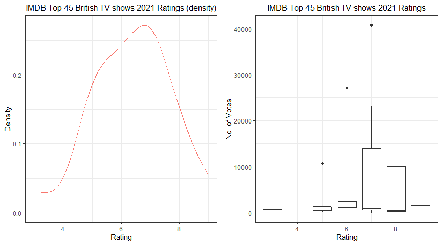

Guided project: Analyzing Movie Ratings
================
Fredrick Boshe
01/05/2021

Looking at IMDB data on how users rate and score movies this project
looks at the correlation between movie ratings and user votes. We shall
extract data for the top 30 movies scored between March and July 2020.

``` r
#scrap webpage
wp_content<-read_html("https://www.imdb.com/list/ls086566770/")
```

``` r
#clean scrapped data
wp_content_titles<-read_html("https://www.imdb.com/list/ls086566770/")%>%
  html_nodes(".sub-list h3 a")%>%
  html_text()

wp_content_year<-read_html("https://www.imdb.com/list/ls086566770/")%>%
  html_nodes(".sub-list h3 span:nth-child(3)")%>%
  html_text()
wp_content_year<-parse_number(wp_content_year)

wp_content_run<-read_html("https://www.imdb.com/list/ls086566770/")%>%
  html_nodes(".sub-list .runtime")%>%
  html_text()
wp_content_run<-parse_number(wp_content_run)

wp_content_genre<-read_html("https://www.imdb.com/list/ls086566770/")%>%
  html_nodes(".sub-list .genre")%>%
  html_text()
wp_content_genre<-str_trim(wp_content_genre)

wp_content_rating<-read_html("https://www.imdb.com/list/ls086566770/")%>%
  html_nodes(".sub-list .small:nth-child(1)")%>%
  html_text()
wp_content_rating<-parse_number(wp_content_rating)

wp_content_vote<-read_html("https://www.imdb.com/list/ls086566770/")%>%
  html_nodes(".sub-list p:nth-child(6) span:nth-child(2)")%>%
  html_text()
wp_content_vote<-parse_number(wp_content_vote)
```

``` r
#Introduce NAs to missing values
append_vector <- function(vector, inserted_indices, values){

  ## Creating the current indices of the vector
  vector_current_indices <- 1:length(vector)

  ## Adding small amount of values (between 0 and 0.9) to the `inserted_indices`
  new_inserted_indices <- inserted_indices + seq(0, 0.9, length.out = length(inserted_indices))

  ## Appending the `new_inserted_indices` to the current vector indices
  indices <- c(vector_current_indices, new_inserted_indices)

  ## Ordering the indices
  ordered_indices <- order(indices)

  ## Appending the new value to the existing vector
  new_vector <- c(vector, values)

  ## Ordering the new vector wrt the ordered indices
  new_vector[ordered_indices]
}


#Runtime
wp_content_genre<-append_vector(wp_content_genre, c(43), NA)
wp_content_run<-append_vector(wp_content_run, c(5,7,9,13,13,13,13,18,18,21,23,
                                23,23,23,23,23,23,23,23,23,23,
                                23,23,23,23,23,23,23,23,23,23), NA)

wp_content_genre<-append_vector(wp_content_genre, c(23), NA)
wp_content_rating<-append_vector(wp_content_rating, c(19,21,21,21,
                                                      25,25,25,25,25,25,25,25,
                                                      25,25,25,25,25,25,25,25,
                                                      25,25,25), NA)
wp_content_vote<-append_vector(wp_content_vote, c(19,21,21,21,
                                                      25,25,25,25,25,25,25,25,
                                                      25,25,25,25,25,25,25,25,
                                                      25,25,25), NA)
```

``` r
movie_df <- tibble("title" = wp_content_titles, 
                   "year" = wp_content_year, 
                   "runtime" = wp_content_run, 
                   "genre" = wp_content_genre, 
                   "rating" = floor(wp_content_rating),
                   "vote" = wp_content_vote)

ggplot(data = movie_df,
       aes(x = rating, y = vote, group = rating)) +
  geom_boxplot()
```

<!-- -->
