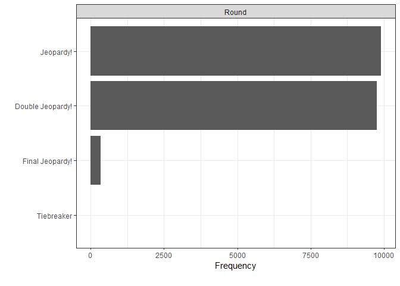
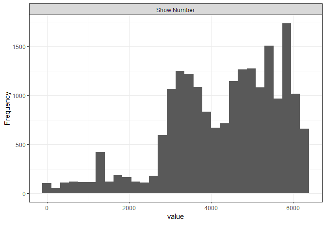

Guided Project: Jeopardy
================
Fredrick Boshe
14/05/2021

``` r
#Overview of dataset
plot_intro(jeo, ggtheme = theme_bw())
```

<!-- -->

``` r
#Frequency of types of Jeopardy rounds
plot_bar(jeo, ggtheme = theme_bw())
```

    ## 5 columns ignored with more than 50 categories.
    ## Air.Date: 336 categories
    ## Category: 3581 categories
    ## Value: 76 categories
    ## Question: 19988 categories
    ## Answer: 14962 categories

<!-- -->

``` r
#Most common amount played for
plot_histogram(jeo, ggtheme = theme_bw())
```

<!-- -->

``` r
#lowercase the column names
colnames(jeo)<-str_to_lower(colnames(jeo))

#Transform value column to numeric
jeo$value<-parse_number(jeo$value)
```

    ## Warning: 336 parsing failures.
    ## row col expected actual
    ##  56  -- a number   None
    ## 117  -- a number   None
    ## 175  -- a number   None
    ## 236  -- a number   None
    ## 297  -- a number   None
    ## ... ... ........ ......
    ## See problems(...) for more details.

``` r
#drop rows with NA on value column
jeo<-jeo%>%
  drop_na(value)
```

``` r
#Normalize text columns (remove punctuation and lower case text)
#Use REGEX and utf8 or string library to remove some punctuation

jeo$category<-str_to_lower(jeo$category) 
jeo$category<-str_replace_all(jeo$category,'[^A-Za-z0-9 ]',"") #Keeping only letters and numerics

jeo$answer<-str_to_lower(jeo$answer) 
jeo$answer<-str_replace_all(jeo$answer,'[^A-Za-z0-9 ]',"") 


jeo$question<-str_to_lower(jeo$question)
jeo$question<-str_replace_all(jeo$question,'[^A-Za-z0-9 ]',"") 
```

``` r
#Transform air date into numeric and split it into 3 columns ( year, month, day) this will help make filtering easier during analysis

jeo<-jeo%>%
  separate(`air date`,
           into = c("year", "month", "day"),
           sep = "-")
jeo$year<-parse_number(jeo$year)
jeo$month<-parse_number(jeo$month)
jeo$day<-parse_number(jeo$day)
```

Our null hypothesis is that Science, History and Shakespeare categories
do not have a higher chance to be selected in the jeopardy game as
compared to other categories.

``` r
#Analyze probability of drawing Science, History and Shakespeare out of all categories

#The number of unique categories
n_cat<-length(unique(jeo$category))
n_ques<- nrow(jeo)

#If every category had the same probability of being selected
p_category_expected = 1/3369 
p_not_category_expected = 3368/3369 

#You can subset datasets by categories to get a better view of actuality
science<-jeo%>%
  filter(str_detect(category, "science"))

#Count occurence of categories and their overall probabilitiy
n_sci<-sum(str_count(jeo$category, "science"))
p_sci<-c(n_sci, n_ques-n_sci)

#You specify the probability in chisq function
p_cat<-c(p_category_expected, p_not_category_expected)
chisq.test(p_sci, p=p_cat)
```

    ## 
    ##  Chi-squared test for given probabilities
    ## 
    ## data:  p_sci
    ## X-squared = 7934.5, df = 1, p-value < 2.2e-16

``` r
##History
n_his<-sum(str_count(jeo$category, "history"))
p_his<-c(n_his, n_ques-n_his)

chisq.test(p_his, p=p_cat)
```

    ## 
    ##  Chi-squared test for given probabilities
    ## 
    ## data:  p_his
    ## X-squared = 11423, df = 1, p-value < 2.2e-16

``` r
##Shakespeare

n_shk<-sum(str_count(jeo$category, "shakespeare"))
p_shk<-c(n_shk, n_ques-n_shk)
chisq.test(p_shk, p=p_cat)
```

    ## 
    ##  Chi-squared test for given probabilities
    ## 
    ## data:  p_shk
    ## X-squared = 2433.7, df = 1, p-value < 2.2e-16

All p-values are significantly lower than 0.05 meaning we can reject the
null hypothesis that science does not have a higher chance of being
selected in the jeopardy game compared to other categories. The same for
History and Shakespeare
