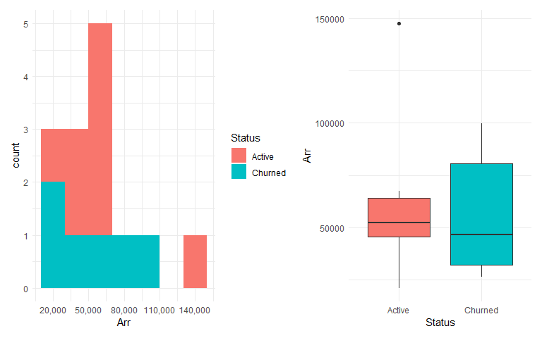
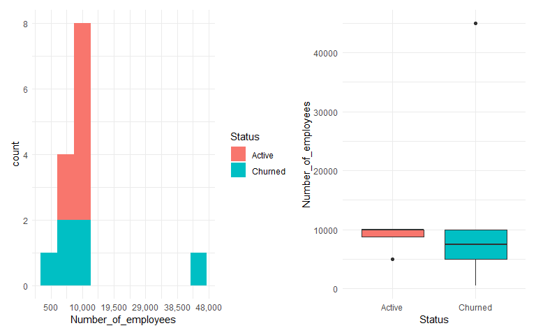
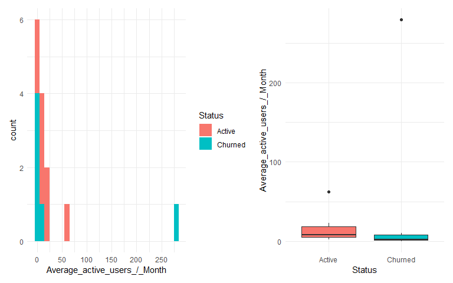
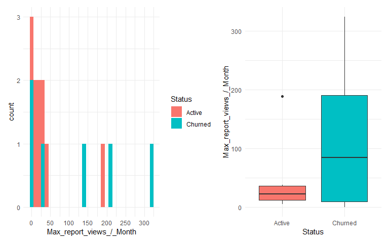
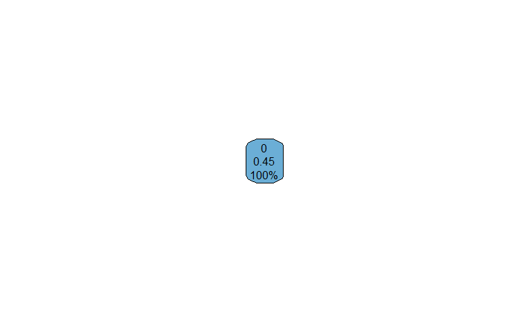
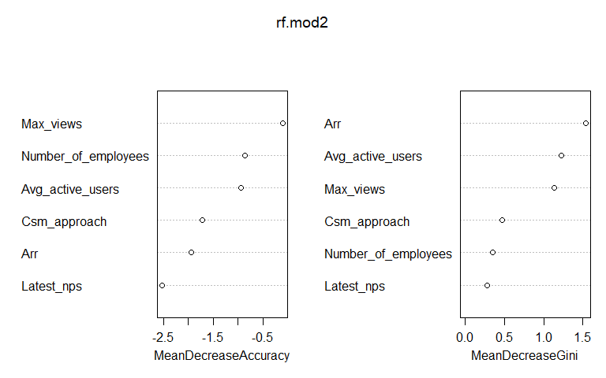
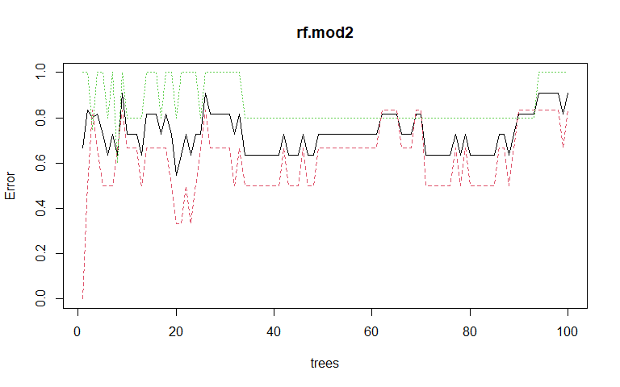
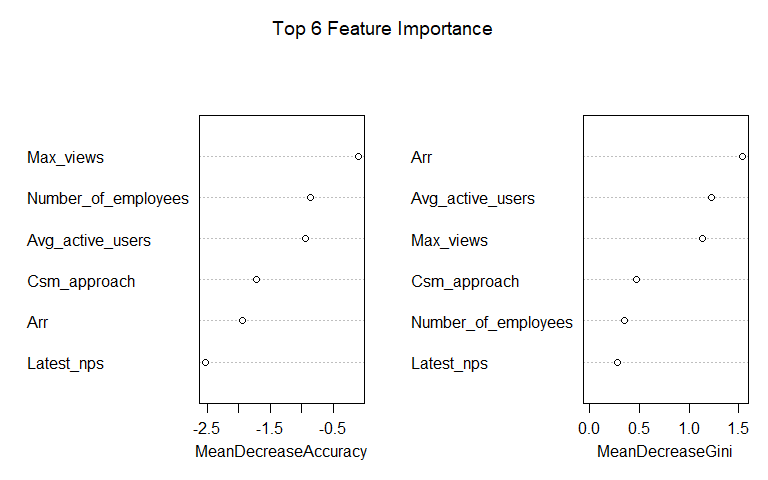

LeanIX
================
Fredrick Boshe
25/05/2021

``` r
#Normalize column names
colnames(churn)<-str_to_lower(colnames(churn))%>%
  str_replace_all("\\s", "_")%>%
  str_to_title(colnames(churn))
```

    ## Warning in opts["locale"] <- locale: number of items to replace is not a
    ## multiple of replacement length

``` r
#Change discrete columns to factors
churn<-churn%>%
  mutate(Status=as.factor(Status),
         Csm_approach=as.factor(Csm_approach))

churn$Arr<-parse_number(churn$Arr)
churn$Company_name<-NULL

# Check NA
sapply(churn, function(x) sum(is.na(x)))
```

    ##                       Status                          Arr 
    ##                            0                            0 
    ##                 Csm_approach          Number_of_employees 
    ##                            0                            0 
    ## Average_active_users_/_Month     Max_report_views_/_Month 
    ##                            0                            0 
    ##                   Latest_nps 
    ##                            6

``` r
#remove NAs
churn <- churn[complete.cases(churn), ]
```

Most significant data cleaning was removing missing data values, 6 of
them, which occured in the NPS column. This shrunk the dataset by 30%.
This is significant for such a samll sample size. I also converted the
**ARR** values to euros, to improve consistency (Multiplied USD values
by 0.8).

``` r
summary(churn)
```

    ##      Status       Arr             Csm_approach Number_of_employees
    ##  Active :8   Min.   : 21120   High Touch:3     Min.   :  500      
    ##  Churned:6   1st Qu.: 40470   Mid Touch :4     1st Qu.: 5000      
    ##              Median : 51595   Tech Touch:7     Median :10000      
    ##              Mean   : 59385                    Mean   :10393      
    ##              3rd Qu.: 66505                    3rd Qu.:10000      
    ##              Max.   :147643                    Max.   :45000      
    ##  Average_active_users_/_Month Max_report_views_/_Month   Latest_nps    
    ##  Min.   :  0.000              Min.   :  0.00           Min.   : 5.000  
    ##  1st Qu.:  2.062              1st Qu.:  8.00           1st Qu.: 9.000  
    ##  Median :  6.170              Median : 26.00           Median : 9.000  
    ##  Mean   : 30.363              Mean   : 73.86           Mean   : 8.714  
    ##  3rd Qu.: 15.393              3rd Qu.:116.00           3rd Qu.: 9.000  
    ##  Max.   :279.670              Max.   :324.00           Max.   :10.000

``` r
p1<-ggplot(churn, aes(Status, fill = Status)) +
  geom_bar() +
  theme_bw()+
  theme(legend.position = 'none')
round(prop.table(table(churn$Status)),3)
```

    ## 
    ##  Active Churned 
    ##   0.571   0.429

``` r
#Continous variable explore
p2<-churn %>%
  keep(is.numeric) %>%
  gather() %>%
  ggplot() +
  geom_histogram(aes(x=value,fill=key), color="black", bins = 15) +
  facet_wrap(~ key, scales = "free") +
  theme_minimal() +
  theme(legend.position = 'none')
table(churn$Latest_nps)
```

    ## 
    ##  5  7  8  9 10 
    ##  1  1  1  8  3

Almost even split between churned and active customers, with 57% of the
customers still being active and the rest churned. Smallest customer has
500 employees with the largest having 45,000 employees. The highest
annual recurring revenue (**ARR**) is 147,643 Euros while the lowest is
21,120 Euros.

Annually, most customers bring in a recurring revenue below 100,000
Euros. With most customers seeing less that 50 active users.
Coincidentally, an NPS value of 9 (followed by 10) was the most frequent
response, meaning most companies are loyal and highly committed to the
company (LeanIX). If 78.5% of the customers are Net Promoters, then why
is there a churn rate of 43%?

My hypothesis is that NPS do not significantly predict likelihood of
customers churning. (Null hypothesis is that NPS does significantly
predict likelihood of customer churning)

``` r
#feature selection
numChurn <- names(which(sapply(churn, is.numeric)))
corr <- cor(churn[,numChurn], use = 'pairwise.complete.obs')
p3<-ggcorrplot(corr, lab = TRUE)

#categorical variable distribution
p4<-churn %>%
  dplyr::select(-Status) %>% 
  keep(is.factor) %>%
  gather() %>%
  group_by(key, value) %>% 
  summarize(n = n()) %>% 
  ggplot() +
  geom_bar(mapping=aes(x = value, y = n, fill=key), color="black", stat='identity') + 
  coord_flip() +
  facet_wrap(~ key, scales = "free") +
  theme_bw() +
  theme(legend.position = 'none')
```

    ## `summarise()` has grouped output by 'key'. You can override using the `.groups` argument.

``` r
round(prop.table(table(churn$Csm_approach)),3)
```

    ## 
    ## High Touch  Mid Touch Tech Touch 
    ##      0.214      0.286      0.500

``` r
summary(churn$Arr)
```

    ##    Min. 1st Qu.  Median    Mean 3rd Qu.    Max. 
    ##   21120   40470   51595   59385   66505  147643

``` r
#Continuous variable exploration
#Arr
p5 <- ggplot(churn, aes(x = Arr, fill = Status)) +
  geom_histogram(binwidth=20000) +
  theme_minimal() +
  scale_x_continuous(breaks = seq(20000,150000,by=30000), labels = comma)

p6 <- ggplot(churn, aes(x = Status, y = Arr, fill = Status)) +
  geom_boxplot() + 
  theme_minimal() +
  theme(legend.position = 'none')

p5 | p6
```



``` r
table(churn$Latest_nps, churn$Status)
```

    ##     
    ##      Active Churned
    ##   5       1       0
    ##   7       0       1
    ##   8       1       0
    ##   9       5       3
    ##   10      1       2

``` r
summary(churn$`Max_report_views_/_Month`)
```

    ##    Min. 1st Qu.  Median    Mean 3rd Qu.    Max. 
    ##    0.00    8.00   26.00   73.86  116.00  324.00

``` r
#No of employees
p7 <- ggplot(churn, aes(x = Number_of_employees, fill = Status)) +
  geom_histogram(binwidth=5000) +
  theme_minimal() +
  scale_x_continuous(breaks = seq(500,50000,by=9500), labels = comma)

p8 <- ggplot(churn, aes(x = Status, y = Number_of_employees, fill = Status)) +
  geom_boxplot() + 
  theme_minimal() +
  theme(legend.position = 'none')

p7 | p8
```



``` r
#No of active
p9 <- ggplot(churn, aes(x = `Average_active_users_/_Month`, fill = Status)) +
  geom_histogram(binwidth=10) +
  theme_minimal() +
  scale_x_continuous(breaks = seq(0,300,by=50), labels = comma)

p10 <- ggplot(churn, aes(x = Status, y = `Average_active_users_/_Month`, fill = Status)) +
  geom_boxplot() + 
  theme_minimal() +
  theme(legend.position = 'none')

p9 | p10
```



``` r
#No of active
p11 <- ggplot(churn, aes(x = `Max_report_views_/_Month`, fill = Status)) +
  geom_histogram(binwidth=10) +
  theme_minimal() +
  scale_x_continuous(breaks = seq(0,350,by=50), labels = comma)

p12 <- ggplot(churn, aes(x = Status, y = `Max_report_views_/_Month`, fill = Status)) +
  geom_boxplot() + 
  theme_minimal() +
  theme(legend.position = 'none')

p11 | p12
```


An analysis of the numeric variables show a weak correlation between
them, allowing us to use all variables in our analysis. Most customers
are on a “Tech Touch” CSM approach level (50%).

Active customers are those with an ARR around 50-60,000 Euros. Over 50%
of the churned customers have an ARR below 50,000 Euros. These might be
the customers that need addressing. Of the active customers, 75% of them
have 10,000 employees. While from the churned customers, 50% of the have
less than 10,000 employees. Smaller companies showing higher churn rate?

Active users tend to skew right, meaning customers that tend to
experience more active monthly users tend to remain active. While those
seeing fewer monthly active members tend to churn. 62% of active
customers had a max monthly report views of 25 and below. While 66% of
churned customers had a max monthly report views higher than 25.

As seen, there are outlier values in almost all indicators. One might be
interested in identifying the outliers and removing them to best
visualize variables.

``` r
#Number of employees
quartiles <- quantile(churn$Number_of_employees)
# 75% minus 25% = interquartile range 
iqr <- quartiles[[4]] - quartiles[[2]]
# Outlier boundaries
lower_bound <- quartiles[[2]] - (1.5 * iqr)
upper_bound <- quartiles[[4]] + (1.5 * iqr)

# Isolate outlier(s)
emp.outliers <- churn%>% 
  filter(Number_of_employees > upper_bound | Number_of_employees< lower_bound)

#ARR
quartiles <- quantile(churn$Arr)
iqr <- quartiles[[4]] - quartiles[[2]]
lower_bound <- quartiles[[2]] - (1.5 * iqr)
upper_bound <- quartiles[[4]] + (1.5 * iqr)

arr.outliers <- churn%>% 
  filter(Arr > upper_bound | Arr< lower_bound)

#Average active
quartiles <- quantile(churn$`Average_active_users_/_Month`)
iqr <- quartiles[[4]] - quartiles[[2]]
lower_bound <- quartiles[[2]] - (1.5 * iqr)
upper_bound <- quartiles[[4]] + (1.5 * iqr)

avg.outliers <- churn%>% 
  filter(`Average_active_users_/_Month` > upper_bound | `Average_active_users_/_Month`< lower_bound)

#Max report views
quartiles <- quantile(churn$`Max_report_views_/_Month`)
iqr <- quartiles[[4]] - quartiles[[2]]
lower_bound <- quartiles[[2]] - (1.5 * iqr)
upper_bound <- quartiles[[4]] + (1.5 * iqr)

rep.outliers <- churn%>% 
  filter(`Max_report_views_/_Month` > upper_bound | `Max_report_views_/_Month`< lower_bound)
```

``` r
churn<-churn%>%
  rename(Churn=Status)

churn<-churn%>%
  mutate(Churn=ifelse(Churn=="Churned", 1, 0))
churn$Churn<-as.factor(churn$Churn)

#Chi square to feature select categorical values
#Sample size is small and affects Chi-square which is sensitive to sample size
fisher.test(table(churn$Churn, churn$Csm_approach))
```

    ## 
    ##  Fisher's Exact Test for Count Data
    ## 
    ## data:  table(churn$Churn, churn$Csm_approach)
    ## p-value = 1
    ## alternative hypothesis: two.sided

``` r
#data partition
set.seed(4)
sample_set <- churn %>%
  pull(.) %>% 
  sample.split(SplitRatio = .7)

churnTrain <- subset(churn, sample_set == TRUE)
churnTest <- subset(churn, sample_set == FALSE)

#Check split
round(prop.table(table(churn$Churn)),3)
```

    ## 
    ##     0     1 
    ## 0.571 0.429

``` r
round(prop.table(table(churnTrain$Churn)),3)
```

    ## 
    ##     0     1 
    ## 0.545 0.455

``` r
round(prop.table(table(churnTest$Churn)),3)
```

    ## 
    ##     0     1 
    ## 0.667 0.333

``` r
#Alternative (i prefer this method)
intrain<- createDataPartition(churn$Churn,p=0.7,list=FALSE)
set.seed(2020)
training<- churn[intrain,]
testing<- churn[-intrain,]


round(prop.table(table(churn$Churn)),3)
```

    ## 
    ##     0     1 
    ## 0.571 0.429

``` r
round(prop.table(table(training$Churn)),3)
```

    ## 
    ##     0     1 
    ## 0.545 0.455

``` r
round(prop.table(table(testing$Churn)),3)
```

    ## 
    ##     0     1 
    ## 0.667 0.333

``` r
## Train the model
logit.mod <- glm(Churn ~., family = binomial(link = 'logit'), 
                 data = churnTrain)
```

    ## Warning: glm.fit: fitted probabilities numerically 0 or 1 occurred

``` r
## Look at the result
summary(logit.mod)
```

    ## 
    ## Call:
    ## glm(formula = Churn ~ ., family = binomial(link = "logit"), data = churnTrain)
    ## 
    ## Deviance Residuals: 
    ##          1           2           3           4           5           6  
    ##  4.900e-06   4.338e-06   2.110e-08   1.047e-05   3.964e-06  -4.900e-06  
    ##          7           8           9          10          11  
    ## -5.936e-06  -2.110e-08  -2.110e-08  -3.964e-06  -1.171e-05  
    ## 
    ## Coefficients:
    ##                                  Estimate Std. Error z value Pr(>|z|)
    ## (Intercept)                    -1.547e+02  6.815e+05       0        1
    ## Arr                            -2.725e-03  7.149e+00       0        1
    ## Csm_approachMid Touch          -7.424e+01  3.240e+05       0        1
    ## Csm_approachTech Touch         -1.400e+02  3.090e+05       0        1
    ## Number_of_employees             1.149e-02  3.316e+01       0        1
    ## `Average_active_users_/_Month`  5.350e-01  1.559e+03       0        1
    ## `Max_report_views_/_Month`      4.022e-01  1.096e+03       0        1
    ## Latest_nps                      2.927e+01  7.654e+04       0        1
    ## 
    ## (Dispersion parameter for binomial family taken to be 1)
    ## 
    ##     Null deviance: 1.5158e+01  on 10  degrees of freedom
    ## Residual deviance: 3.8016e-10  on  3  degrees of freedom
    ## AIC: 16
    ## 
    ## Number of Fisher Scoring iterations: 24

``` r
## Predict the outcomes against our test data
logit.pred.prob <- predict(logit.mod, churnTest, type = 'response')
logit.pred <- as.factor(ifelse(logit.pred.prob > 0.5, 1, 0))
head(churnTest)
```

    ## # A tibble: 3 x 7
    ##   Churn    Arr Csm_approach Number_of_emplo~ `Average_active~ `Max_report_vie~
    ##   <fct>  <dbl> <fct>                   <dbl>            <dbl>            <dbl>
    ## 1 1     8.99e4 Mid Touch               45000              0                  0
    ## 2 0     5.46e4 Mid Touch               10000             62.3              189
    ## 3 0     1.48e5 High Touch              10000             22.7               25
    ## # ... with 1 more variable: Latest_nps <dbl>

``` r
head(logit.pred.prob)
```

    ##            1            2            3 
    ## 1.000000e+00 1.000000e+00 2.220446e-16

``` r
#Confusion matrix
caret::confusionMatrix(logit.pred, churnTest$Churn, positive = "1")
```

    ## Confusion Matrix and Statistics
    ## 
    ##           Reference
    ## Prediction 0 1
    ##          0 1 0
    ##          1 1 1
    ##                                           
    ##                Accuracy : 0.6667          
    ##                  95% CI : (0.0943, 0.9916)
    ##     No Information Rate : 0.6667          
    ##     P-Value [Acc > NIR] : 0.7407          
    ##                                           
    ##                   Kappa : 0.4             
    ##                                           
    ##  Mcnemar's Test P-Value : 1.0000          
    ##                                           
    ##             Sensitivity : 1.0000          
    ##             Specificity : 0.5000          
    ##          Pos Pred Value : 0.5000          
    ##          Neg Pred Value : 1.0000          
    ##              Prevalence : 0.3333          
    ##          Detection Rate : 0.3333          
    ##    Detection Prevalence : 0.6667          
    ##       Balanced Accuracy : 0.7500          
    ##                                           
    ##        'Positive' Class : 1               
    ## 

``` r
#Feature analysis
anova(logit.mod, test="Chisq")
```

    ## Warning: glm.fit: algorithm did not converge

    ## Warning: glm.fit: fitted probabilities numerically 0 or 1 occurred

    ## Analysis of Deviance Table
    ## 
    ## Model: binomial, link: logit
    ## 
    ## Response: Churn
    ## 
    ## Terms added sequentially (first to last)
    ## 
    ## 
    ##                                Df Deviance Resid. Df Resid. Dev Pr(>Chi)   
    ## NULL                                              10     15.158            
    ## Arr                             1   0.0100         9     15.148 0.920335   
    ## Csm_approach                    2   0.0501         7     15.098 0.975280   
    ## Number_of_employees             1   2.0871         6     13.011 0.148547   
    ## `Average_active_users_/_Month`  1   2.8511         5     10.160 0.091312 . 
    ## `Max_report_views_/_Month`      1  10.1599         4      0.000 0.001435 **
    ## Latest_nps                      1   0.0000         3      0.000 0.999898   
    ## ---
    ## Signif. codes:  0 '***' 0.001 '**' 0.01 '*' 0.05 '.' 0.1 ' ' 1

``` r
#Odd ratio
exp(cbind(coef(logit.mod), confint.default(logit.mod)))
```

    ##                                                    2.5 %       97.5 %
    ## (Intercept)                    6.588966e-68 0.000000e+00          Inf
    ## Arr                            9.972788e-01 8.189014e-07 1.214511e+06
    ## Csm_approachMid Touch          5.746905e-33 0.000000e+00          Inf
    ## Csm_approachTech Touch         1.532637e-61 0.000000e+00          Inf
    ## Number_of_employees            1.011558e+00 6.053560e-29 1.690326e+28
    ## `Average_active_users_/_Month` 1.707439e+00 0.000000e+00          Inf
    ## `Max_report_views_/_Month`     1.495160e+00 0.000000e+00          Inf
    ## Latest_nps                     5.156803e+12 0.000000e+00          Inf

``` r
#Decision Tree
training<-training%>%
  rename(Avg_active_users=`Average_active_users_/_Month`,
         Max_views=`Max_report_views_/_Month`)

tree.model <- rpart(Churn ~ .,
                    data = training,
                    method = "class",
                    control = rpart.control(xval = 10))
# Plot
rpart.plot(tree.model)
```



``` r
#random forest
## Create a control object.
ctrl <- trainControl(method = "cv",
                     number = 2,
                     selectionFunction = "best")

## Create a grid search based on the available parameters.
grid <- expand.grid(.mtry = c(1:8))

## Build the random forest model
rf.mod <- 
  train(Churn ~.,
        data = training,
        method = 'rf',
        metric = 'Kappa',
        trControl = ctrl,
        tuneGrid = grid)

rf.mod
```

    ## Random Forest 
    ## 
    ## 11 samples
    ##  6 predictor
    ##  2 classes: '0', '1' 
    ## 
    ## No pre-processing
    ## Resampling: Cross-Validated (2 fold) 
    ## Summary of sample sizes: 6, 5 
    ## Resampling results across tuning parameters:
    ## 
    ##   mtry  Accuracy  Kappa      
    ##   1     0.55       0.08333333
    ##   2     0.45      -0.18181818
    ##   3     0.45      -0.18181818
    ##   4     0.45      -0.18181818
    ##   5     0.45      -0.18181818
    ##   6     0.45      -0.18181818
    ##   7     0.45      -0.18181818
    ##   8     0.45      -0.18181818
    ## 
    ## Kappa was used to select the optimal model using the largest value.
    ## The final value used for the model was mtry = 1.

``` r
#Alternative
set.seed(4)
rf.mod2 = randomForest(Churn ~ ., data=training, ntree=100, mtry=3, importance=TRUE)

rf.mod2
```

    ## 
    ## Call:
    ##  randomForest(formula = Churn ~ ., data = training, ntree = 100,      mtry = 3, importance = TRUE) 
    ##                Type of random forest: classification
    ##                      Number of trees: 100
    ## No. of variables tried at each split: 3
    ## 
    ##         OOB estimate of  error rate: 90.91%
    ## Confusion matrix:
    ##   0 1 class.error
    ## 0 1 5   0.8333333
    ## 1 5 0   1.0000000

``` r
varImpPlot(rf.mod2)
```



``` r
plot(rf.mod2) #8 trees lowers the error rate
```



``` r
#Try new forest model
rf.mod2_new<- randomForest(Churn ~ ., data=training, ntree=3, mtry=5, importance=TRUE, proximity=TRUE)
rf.mod2_new
```

    ## 
    ## Call:
    ##  randomForest(formula = Churn ~ ., data = training, ntree = 3,      mtry = 5, importance = TRUE, proximity = TRUE) 
    ##                Type of random forest: classification
    ##                      Number of trees: 3
    ## No. of variables tried at each split: 5
    ## 
    ##         OOB estimate of  error rate: 88.89%
    ## Confusion matrix:
    ##   0 1 class.error
    ## 0 1 4         0.8
    ## 1 4 0         1.0

``` r
#Error rate went down from 60% to 50%

varImpPlot(rf.mod2, sort=T, n.var = 6, main = 'Top 6 Feature Importance')
```



As the dataset is small, it is hard to find any significant values
(p-values) as the standard errors are also very big. While the
prediction model has an accuracy of 66% its pvalue is not significant
(small sample size effects).

The most relevant indicators on churn are number of employees (size of
the company), average active users and max report views per month. Only
Max report views is significant at the 99% level, while average active
users is significant at the 90% level. Interestingly, NPS values do not
do a very good job at predicting if a customer will churn or not! We can
reject the null hypothesis that NPS predicts customer churn.

As a CMS it would be wise to monitor customer’s average users on the
SaaS (product usage/consumption) as well as the average active users per
month. These would be the best predictors for any potential customer
likely to churn.

If we are to check just the most significant factor, the odds of a
customer churning increases 1.5 times for each increase in max report
views.

Using the random forest predictor, the error rate is relatively low when
predicting customers that will not churn while it is relatively high
when predicting customers that will churn.
