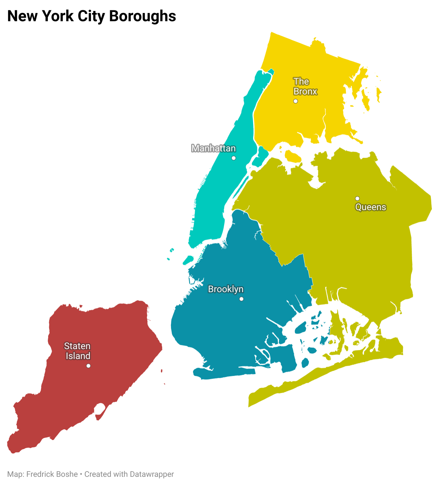

New York city is known to be one of the most expensive cities in the world when it comes to real estate. The city has 5 different **boroughs**, with each having its unique socioeconomic profile that helps determine the real estate prices. 

<center>
{width=65%}
</center>


Using data shared by the [New York City department of Finance](https://www1.nyc.gov/site/finance/taxes/property-rolling-sales-data.page), this project looks to analyze housing costs for the last 12 months and use regression models to predict prices based on indicators.
 
```{r setup, include=FALSE}
#Loading packages
library(tidyverse)
library(ggplot2)
library(dplyr)
library(corrplot)
library(plotly)
library(ggcorrplot)
library(scales)
library(lubridate)
library(jsonlite)
library(readxl)
library(DataExplorer)
library(broom)


#Load data
manhattan<-read_excel("C:/Users/ricky/Documents/Datasets/NYC Property Sales/rollingsales_manhattan.xls", skip = 4)
brooklyn<-read_excel("C:/Users/ricky/Documents/Datasets/NYC Property Sales/rollingsales_brooklyn.xls", skip = 4)
staten<-read_excel("C:/Users/ricky/Documents/Datasets/NYC Property Sales/rollingsales_statenisland.xls", skip = 4)
bronx<-read_excel("C:/Users/ricky/Documents/Datasets/NYC Property Sales/rollingsales_bronx.xls", skip = 4)
queens<-read_excel("C:/Users/ricky/Documents/Datasets/NYC Property Sales/rollingsales_queens.xls", skip = 4)

```

The data is found in 4 distinct excel files. Read them to the environment and merge them in a single dataframe, making it easier to handle. 

```{r cleaning, include=TRUE}
#The boroughs are coded (manhattan=1, bronx=2, brooklyn=3, queens=4, staten=5)
nyc<-bind_rows(manhattan,bronx,brooklyn,queens,staten)

#Recode the boroughs
nyc<-nyc%>%
  mutate(
    BOROUGH=case_when(
      BOROUGH=="1" ~ "Manhattan",
      BOROUGH=="2" ~ "Bronx",
      BOROUGH=="3" ~ "Brooklyn",
      BOROUGH=="4" ~ "Queens",
      BOROUGH=="5" ~ "Staten Island"
      )
    )

#remove the individual dataframes
rm(bronx, brooklyn, manhattan, queens, staten)

#Normalize the column names (lower column names and remove space)
colnames(nyc)<-str_to_lower(colnames(nyc))%>%
  str_replace_all("\\s", "_")%>%
  str_to_title(colnames(nyc))

#some of the properties were exchanged between family members (i.e. filter with a threshold of 10,000$)
summary(nyc$Sale_price)
nyc<-nyc%>%
  filter(Sale_price>10000)

#Some properties have square footage of 0, which is unlikely in reality. Remove
summary(nyc$Gross_square_feet)
nyc<-nyc%>%
  filter(Gross_square_feet>0)

#Initial removal of variables that are not of interest
nyc<-nyc%>%
  select(-5,-6,-7,-8,-10)
```

The initial data cleaning and manipulation helps set the data up ready for exploration and followed by analysis.

```{r explore, include=TRUE, fig.align='center', fig.width=8, message=FALSE}
plot_intro(nyc, ggtheme = theme_bw())

sum(is.na(nyc$Year_built))
nyc<-nyc%>%
  drop_na(Year_built)

table(nyc$Borough)

#Plot continuous and discrete values
plot_histogram(nyc, ggtheme = theme_bw(), ncol = 2)
plot_bar(nyc, maxcat = 5, 
         ggtheme = theme_bw())

#Keep only family dwellings only
nyc<-nyc%>%
  filter(Building_class_category=="01 ONE FAMILY DWELLINGS" | Building_class_category=="02 TWO FAMILY DWELLINGS" | Building_class_category=="03 THREE FAMILY DWELLINGS")%>%
  mutate(Building_class_category=
           case_when(
             Building_class_category=="01 ONE FAMILY DWELLINGS" ~ "One Family Dwellings",
             Building_class_category=="02 TWO FAMILY DWELLINGS" ~ "Two Family Dwellings",
             Building_class_category=="03 THREE FAMILY DWELLINGS" ~ "Three Family Dwellings"
             )
         )

table(nyc$Borough)

plot_bar(nyc, maxcat = 5,
         ncol = 2,
         ggtheme = theme_bw())

```
Very few missing observations (14), and they seem to be from the *Year Built* column. We can go ahead and remove them since they make up just 0.04% of the data.


You can also observe that most variables have very huge outliers that skew their charts positively. Going forward, we might need to deal with the outliers. One potential way is by keeping just residential dwellings (building codes can be found [here](https://www1.nyc.gov/assets/finance/jump/hlpbldgcode.html)). Manhattan will see a considerable drop in observations (<span style="color: red;">76%</span>) while the least drop in observations was for Staten Island (<span style="color: red;">2%</span>).  coincidentally lower the number of observations from Manhattan. 


```{r outliers, include=TRUE}
#Residential Units
quartiles <- quantile(nyc$Residential_units)
# 75% minus 25% = interquartile range 
iqr <- quartiles[[4]] - quartiles[[2]]
# Outlier boundaries
lower_bound <- quartiles[[2]] - (1.5 * iqr)
upper_bound <- quartiles[[4]] + (1.5 * iqr)

# Isolate outlier(s)
res.outliers <- nyc%>% 
  filter(Residential_units > upper_bound | Residential_units< lower_bound)

#Land
quartiles <- quantile(nyc$Land_square_feet)
iqr <- quartiles[[4]] - quartiles[[2]]
lower_bound <- quartiles[[2]] - (1.5 * iqr)
upper_bound <- quartiles[[4]] + (1.5 * iqr)

land.outliers <- nyc%>% 
  filter(Land_square_feet > upper_bound | Land_square_feet< lower_bound)

#Price
quartiles <- quantile(nyc$Sale_price)
iqr <- quartiles[[4]] - quartiles[[2]]
lower_bound <- quartiles[[2]] - (1.5 * iqr)
upper_bound <- quartiles[[4]] + (1.5 * iqr)

price.outliers <- nyc%>% 
  filter(Borough=="Bronx")%>%
  filter(Sale_price > upper_bound | Sale_price< lower_bound)
```


```{r cleaning2, include=TRUE, fig.align='center', fig.width=8}
#Recode columns to proper data types
nyc<-nyc%>%
  mutate(Borough=as.factor(Borough),
         Neighborhood=as.factor(Neighborhood),
         Tax_class_at_time_of_sale=as.factor(Tax_class_at_time_of_sale),
         Zip_code=as.factor(Zip_code),
         Building_class_at_time_of_sale=as.factor(Building_class_at_time_of_sale),
         Building_class_category=as.factor(Building_class_category))
nyc$Address<-NULL
nyc$Neighborhood<-NULL
nyc$Zip_code<-NULL
nyc$Tax_class_at_present<-NULL


#Check for multicorrliniality
numnyc <- names(which(sapply(nyc, is.numeric)))
corr <- cor(nyc[,numnyc], use = 'pairwise.complete.obs')
p3<-ggcorrplot(corr, lab = TRUE)
p3

#Total units has strong relationship with Residential units, so i shall remove it
nyc$Total_units<-NULL

#Visualize relationship between slae price and gross size
nyc%>%ggplot(aes(x=Gross_square_feet, y=Sale_price, color=Borough))+
  geom_point()+
  theme_bw()+
  geom_smooth(method = "lm", se = FALSE)+
  theme(legend.position = "none")+
  facet_wrap(~Borough, ncol = 2, scales = "free")

#Bronx has two duplicate outliers, remove them
nyc<-nyc%>%
  filter(Sale_price!=87400000)

#remove duplicates
nyc<-nyc%>%
  distinct()

#Visualize relationship again
nyc%>%ggplot(aes(x=Gross_square_feet, y=Sale_price, color=Borough))+
  geom_point()+
  theme_bw()+
  geom_smooth(method = "lm", se = FALSE)+
  theme(legend.position = "none")+
  scale_y_continuous(labels = comma)+
  facet_wrap(~Borough, ncol = 2, scales = "free")

#Regression
nyc_fit<-lm(Sale_price~Borough+Building_class_category+
              Residential_units+Commercial_units+Land_square_feet+
              Gross_square_feet+Year_built+Building_class_at_time_of_sale, data=nyc)
summary(nyc_fit)


#Generate multiple linear models
##First nest data by the category
nyc_nest<-nyc%>%
  group_by(Borough)%>%
  nest()

##Second run a liner regression across all categories, using a mapping function
nyc_nest<-nyc_nest%>%
  mutate(linear_model=map(.x= data, 
                          .f= ~lm(Sale_price~Building_class_category+Residential_units+
                                    Commercial_units+Land_square_feet+Gross_square_feet+
                                    Year_built+Building_class_at_time_of_sale, data=.)
                          ))

##Third select the broom function suitable
#a) Tidy the data
nyc_nest<-nyc_nest%>%
  mutate(tidy_coef=map(.x=linear_model,
                       .f=tidy, conf.int=TRUE))

#Fourth we Unnest
nyc_nest%>%
  select(Borough, tidy_coef)%>%
  unnest(cols = tidy_coef)%>%
  filter(term=="Gross_square_feet")%>%
  arrange(estimate)

#This shows that Manhattan has the highest increase in sale price for every increase in gross square feet. Bronx has the lowest


#a) glance the data (this has r-squared)
nyc_nest<-nyc_nest%>%
  mutate(glance_coef=map(.x=linear_model,
                       .f=glance))

#we Unnest
nyc_nest%>%
  select(Borough, glance_coef)%>%
  unnest(cols = glance_coef)%>%
  select(r.squared)%>%
  arrange(r.squared)

#Brooklyn has the lowest R squared while Manhattan has the highest R Squared
```
