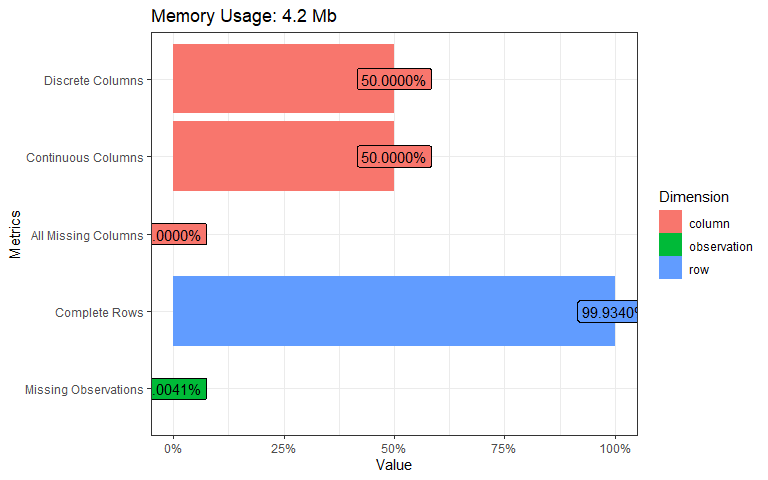
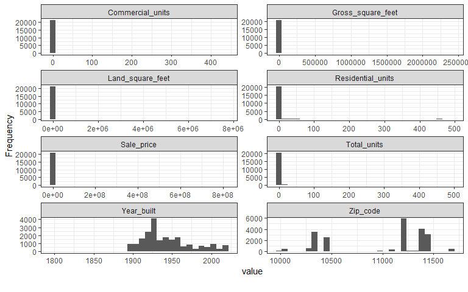
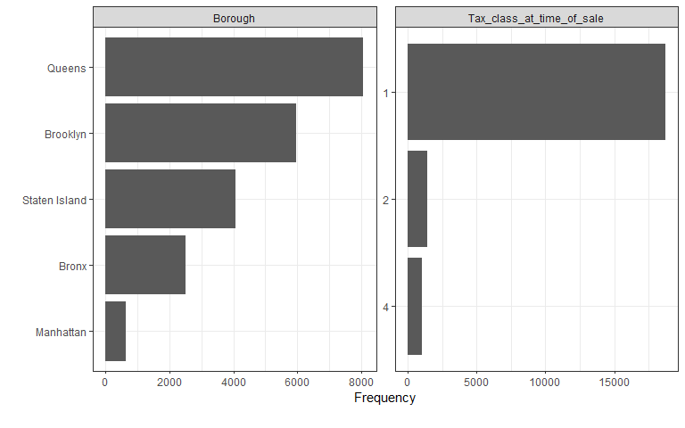
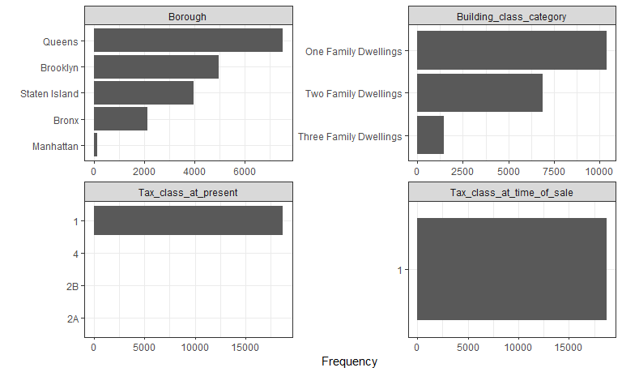

NYC Property Sales
================
Fredrick Boshe
24/05/2021

New York city is known to be one of the most expensive cities in the
world when it comes to real estate. The city has 5 different
**boroughs**, with each having its unique socioeconomic profile that
helps determine the real estate prices.

<center>

</center>

Using data shared by the [New York City department of
Finance](https://www1.nyc.gov/site/finance/taxes/property-rolling-sales-data.page),
this project looks to analyze housing costs for the last 12 months and
use regression models to predict prices based on indicators.

The data is found in 4 distinct excel files. Read them to the
environment and merge them in a single dataframe, making it easier to
handle.

``` r
#The boroughs are coded (manhattan=1, bronx=2, brooklyn=3, queens=4, staten=5)
nyc<-bind_rows(manhattan,bronx,brooklyn,queens,staten)

#Recode the boroughs
nyc<-nyc%>%
  mutate(
    BOROUGH=case_when(
      BOROUGH=="1" ~ "Manhattan",
      BOROUGH=="2" ~ "Bronx",
      BOROUGH=="3" ~ "Brooklyn",
      BOROUGH=="4" ~ "Queens",
      BOROUGH=="5" ~ "Staten Island"
      )
    )

#remove the individual dataframes
rm(bronx, brooklyn, manhattan, queens, staten)

#Normalize the column names (lower column names and remove space)
colnames(nyc)<-str_to_lower(colnames(nyc))%>%
  str_replace_all("\\s", "_")%>%
  str_to_title(colnames(nyc))
```

    ## Warning in opts["locale"] <- locale: number of items to replace is not a
    ## multiple of replacement length

``` r
#some of the properties were exchanged between family members (i.e. filter with a threshold of 10,000$)
summary(nyc$Sale_price)
```

    ##      Min.   1st Qu.    Median      Mean   3rd Qu.      Max. 
    ##         0         0    470000   1184058    880000 809912583

``` r
nyc<-nyc%>%
  filter(Sale_price>10000)

#Some properties have square footage of 0, which is unlikely in reality. Remove
summary(nyc$Gross_square_feet)
```

    ##    Min. 1st Qu.  Median    Mean 3rd Qu.    Max.    NA's 
    ##       0    1300    1791    7190    2544 2400000   22601

``` r
nyc<-nyc%>%
  filter(Gross_square_feet>0)

#Initial removal of variables that are not of interest
nyc<-nyc%>%
  select(-5,-6,-7,-8,-10)
```

The initial data cleaning and manipulation helps set the data up ready
for exploration and followed by analysis.

``` r
plot_intro(nyc, ggtheme = theme_bw())
```



``` r
sum(is.na(nyc$Year_built))
```

    ## [1] 14

``` r
nyc<-nyc%>%
  drop_na(Year_built)

table(nyc$Borough)
```

    ## 
    ##         Bronx      Brooklyn     Manhattan        Queens Staten Island 
    ##          2491          5960           616          8066          4067

``` r
#Plot continuous and discrete values
plot_histogram(nyc, ggtheme = theme_bw(), ncol = 2)
```



``` r
plot_bar(nyc, maxcat = 5, 
         ggtheme = theme_bw())
```



``` r
#Keep only family dwellings only
nyc<-nyc%>%
  filter(Building_class_category=="01 ONE FAMILY DWELLINGS" | Building_class_category=="02 TWO FAMILY DWELLINGS" | Building_class_category=="03 THREE FAMILY DWELLINGS")%>%
  mutate(Building_class_category=
           case_when(
             Building_class_category=="01 ONE FAMILY DWELLINGS" ~ "One Family Dwellings",
             Building_class_category=="02 TWO FAMILY DWELLINGS" ~ "Two Family Dwellings",
             Building_class_category=="03 THREE FAMILY DWELLINGS" ~ "Three Family Dwellings"
             )
         )

table(nyc$Borough)
```

    ## 
    ##         Bronx      Brooklyn     Manhattan        Queens Staten Island 
    ##          2123          4961           148          7499          3965

``` r
plot_histogram(nyc, ggtheme = theme_bw(), ncol = 2)
```



``` r
plot_bar(nyc, maxcat = 5, ncol = 2,
         ggtheme = theme_bw())
```


Very few missing observations (14), and they seem to be from the *Year
Built* column. We can go ahead and remove them since they make up just
0.04% of the data.

You can also observe that most variables have very huge outliers that
skew their charts positively. Going forward, we might need to deal with
the outliers. One potential way is by keeping just residential dwellings
(building codes can be found
[here](https://www1.nyc.gov/assets/finance/jump/hlpbldgcode.html)).
Manhattan will see a considerable drop in observations (<span
style="color: red;">76%</span>) while the least drop in observations was
for Staten Island (<span style="color: red;">2%</span>). coincidentally
lower the number of observations from Manhattan.
