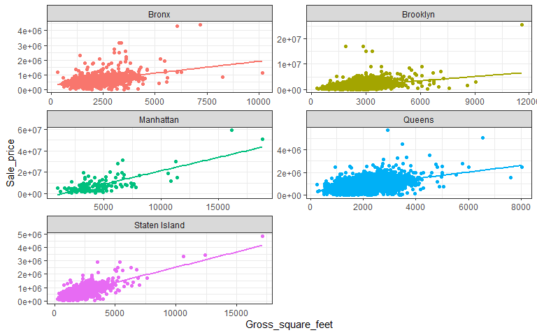

NYC Property Sales
================
Fredrick Boshe
24/05/2021

## Introduction

New York city is known to be one of the most expensive cities in the
world when it comes to real estate. The city has 5 different
**boroughs**, with each having its unique socioeconomic profile that
helps determine the real estate prices.

<center>

</center>

Using data shared by the [New York City department of
Finance](https://www1.nyc.gov/site/finance/taxes/property-rolling-sales-data.page),
this project looks to analyze housing costs for the last 12 months and
use regression models to predict prices based on indicators.

## Data Manipulation

The data is found in 4 distinct excel files. Read them to the
environment and merge them in a single dataframe, making it easier to
handle.

### Data Cleaning

``` r
#The boroughs are coded (manhattan=1, bronx=2, brooklyn=3, queens=4, staten=5)
nyc<-bind_rows(manhattan,bronx,brooklyn,queens,staten)

#Recode the boroughs
nyc<-nyc%>%
  mutate(
    BOROUGH=case_when(
      BOROUGH=="1" ~ "Manhattan",
      BOROUGH=="2" ~ "Bronx",
      BOROUGH=="3" ~ "Brooklyn",
      BOROUGH=="4" ~ "Queens",
      BOROUGH=="5" ~ "Staten Island"
      )
    )

#remove the individual dataframes
rm(bronx, brooklyn, manhattan, queens, staten)

#Normalize the column names (lower column names and remove space)
colnames(nyc)<-str_to_lower(colnames(nyc))%>%
  str_replace_all("\\s", "_")%>%
  str_to_title(colnames(nyc))
```

    ## Warning in opts["locale"] <- locale: number of items to replace is not a
    ## multiple of replacement length

``` r
#some of the properties were exchanged between family members (i.e. filter with a threshold of 10,000$)
summary(nyc$Sale_price)
```

    ##      Min.   1st Qu.    Median      Mean   3rd Qu.      Max. 
    ##         0         0    470000   1184058    880000 809912583

``` r
nyc<-nyc%>%
  filter(Sale_price>10000)

#Some properties have square footage of 0, which is unlikely in reality. Remove
summary(nyc$Gross_square_feet)
```

    ##    Min. 1st Qu.  Median    Mean 3rd Qu.    Max.    NA's 
    ##       0    1300    1791    7190    2544 2400000   22601

``` r
nyc<-nyc%>%
  filter(Gross_square_feet>0)

#Initial removal of variables that are not of interest
nyc<-nyc%>%
  select(-5,-6,-7,-8,-10)
```

The initial data cleaning and manipulation helps set the data up ready
for exploration and followed by analysis i.e. removing missing
observations and exploring the data.

### Data Exploration

``` r
plot_intro(nyc, ggtheme = theme_bw())
```


``` r
sum(is.na(nyc$Year_built))
```

    ## [1] 14

``` r
nyc<-nyc%>%
  drop_na(Year_built)

table(nyc$Borough)
```

    ## 
    ##         Bronx      Brooklyn     Manhattan        Queens Staten Island 
    ##          2491          5960           616          8066          4067

``` r
#Plot continuous and discrete values
plot_histogram(nyc, ggtheme = theme_bw(), ncol = 2)
```


``` r
plot_bar(nyc, maxcat = 5, 
         ggtheme = theme_bw())
```


``` r
#Keep only family dwellings only
nyc<-nyc%>%
  filter(Building_class_category=="01 ONE FAMILY DWELLINGS" | Building_class_category=="02 TWO FAMILY DWELLINGS" | Building_class_category=="03 THREE FAMILY DWELLINGS")%>%
  mutate(Building_class_category=
           case_when(
             Building_class_category=="01 ONE FAMILY DWELLINGS" ~ "One Family Dwellings",
             Building_class_category=="02 TWO FAMILY DWELLINGS" ~ "Two Family Dwellings",
             Building_class_category=="03 THREE FAMILY DWELLINGS" ~ "Three Family Dwellings"
             )
         )

table(nyc$Borough)
```

    ## 
    ##         Bronx      Brooklyn     Manhattan        Queens Staten Island 
    ##          2123          4961           148          7499          3965

``` r
plot_bar(nyc, maxcat = 5,
         ncol = 2,
         ggtheme = theme_bw())
```


Very few missing observations (14), and they seem to be from the *Year
Built* column. We can go ahead and remove them since they make up just
0.04% of the data.

You can also observe that most variables have very huge outliers that
skew their charts positively. Going forward, we might need to deal with
the outliers. One potential way is by keeping just residential dwellings
(building codes can be found
[here](https://www1.nyc.gov/assets/finance/jump/hlpbldgcode.html)).
Manhattan will see a considerable drop in observations (<span
style="color: red;">76%</span>) while the least drop in observations was
for Staten Island (<span style="color: red;">2%</span>).

### Data Outliers

``` r
#Residential Units
quartiles <- quantile(nyc$Residential_units)
# 75% minus 25% = interquartile range 
iqr <- quartiles[[4]] - quartiles[[2]]
# Outlier boundaries
lower_bound <- quartiles[[2]] - (1.5 * iqr)
upper_bound <- quartiles[[4]] + (1.5 * iqr)

# Isolate outlier(s)
res.outliers <- nyc%>% 
  filter(Residential_units > upper_bound | Residential_units< lower_bound)

#Land
quartiles <- quantile(nyc$Land_square_feet)
iqr <- quartiles[[4]] - quartiles[[2]]
lower_bound <- quartiles[[2]] - (1.5 * iqr)
upper_bound <- quartiles[[4]] + (1.5 * iqr)

land.outliers <- nyc%>% 
  filter(Land_square_feet > upper_bound | Land_square_feet< lower_bound)

#Price
quartiles <- quantile(nyc$Sale_price)
iqr <- quartiles[[4]] - quartiles[[2]]
lower_bound <- quartiles[[2]] - (1.5 * iqr)
upper_bound <- quartiles[[4]] + (1.5 * iqr)

price.outliers <- nyc%>% 
  filter(Borough=="Bronx")%>%
  filter(Sale_price > upper_bound | Sale_price< lower_bound)

#Bronx has two duplicate outliers, remove them
nyc<-nyc%>%
  filter(Sale_price!=87400000)

#remove duplicates
nyc<-nyc%>%
  distinct()
```

## Modeling

To successfully model real estate prices we must select the best
predictor variables (independent variables) that will best explain the
prices.

### Factor selection

As OLS assumes no multicollinearity between independent variables, a
correlation matrix helps us identify variables that are strongly
correlated and thus removable. In our case, *Total Units* is highly
correlated with *Residential units* and mildly correlated with *Gross
Square Feet*. We therefore remove *Total Units* from the equation.

``` r
#Recode columns to proper data types
nyc<-nyc%>%
  mutate(Borough=as.factor(Borough),
         Neighborhood=as.factor(Neighborhood),
         Tax_class_at_time_of_sale=as.factor(Tax_class_at_time_of_sale),
         Zip_code=as.factor(Zip_code),
         Building_class_at_time_of_sale=as.factor(Building_class_at_time_of_sale),
         Building_class_category=as.factor(Building_class_category))
nyc$Address<-NULL
nyc$Neighborhood<-NULL
nyc$Zip_code<-NULL
nyc$Tax_class_at_present<-NULL

#Check for multicollinearity
numnyc <- names(which(sapply(nyc, is.numeric)))
corr <- cor(nyc[,numnyc], use = 'pairwise.complete.obs')
p3<-ggcorrplot(corr, lab = TRUE)
p3
```


``` r
#Total units has strong relationship with Residential units, so i shall remove it
nyc$Total_units<-NULL

#Visualize relationship between sale price and gross size
nyc%>%ggplot(aes(x=Gross_square_feet, y=Sale_price, color=Borough))+
  geom_point()+
  theme_bw()+
  geom_smooth(method = "lm", se = FALSE)+
  theme(legend.position = "none")+
  facet_wrap(~Borough, ncol = 2, scales = "free")
```

    ## `geom_smooth()` using formula 'y ~ x'



### Regression

``` r
#Regression with two most important factors, Borough and gross size of property
nyc_fit<-lm(Sale_price~Borough+Gross_square_feet, data=nyc)
summ(nyc_fit)
```

<table class="table table-striped table-hover table-condensed table-responsive" style="width: auto !important; margin-left: auto; margin-right: auto;">
<tbody>
<tr>
<td style="text-align:left;font-weight: bold;">
Observations
</td>
<td style="text-align:right;">
18694
</td>
</tr>
<tr>
<td style="text-align:left;font-weight: bold;">
Dependent variable
</td>
<td style="text-align:right;">
Sale\_price
</td>
</tr>
<tr>
<td style="text-align:left;font-weight: bold;">
Type
</td>
<td style="text-align:right;">
OLS linear regression
</td>
</tr>
</tbody>
</table>
<table class="table table-striped table-hover table-condensed table-responsive" style="width: auto !important; margin-left: auto; margin-right: auto;">
<tbody>
<tr>
<td style="text-align:left;font-weight: bold;">
F(5,18688)
</td>
<td style="text-align:right;">
2821.81
</td>
</tr>
<tr>
<td style="text-align:left;font-weight: bold;">
R²
</td>
<td style="text-align:right;">
0.43
</td>
</tr>
<tr>
<td style="text-align:left;font-weight: bold;">
Adj. R²
</td>
<td style="text-align:right;">
0.43
</td>
</tr>
</tbody>
</table>
<table class="table table-striped table-hover table-condensed table-responsive" style="width: auto !important; margin-left: auto; margin-right: auto;border-bottom: 0;">
<thead>
<tr>
<th style="text-align:left;">
</th>
<th style="text-align:right;">
Est.
</th>
<th style="text-align:right;">
S.E.
</th>
<th style="text-align:right;">
t val.
</th>
<th style="text-align:right;">
p
</th>
</tr>
</thead>
<tbody>
<tr>
<td style="text-align:left;font-weight: bold;">
(Intercept)
</td>
<td style="text-align:right;">
-420293.81
</td>
<td style="text-align:right;">
25003.92
</td>
<td style="text-align:right;">
-16.81
</td>
<td style="text-align:right;">
0.00
</td>
</tr>
<tr>
<td style="text-align:left;font-weight: bold;">
BoroughBrooklyn
</td>
<td style="text-align:right;">
536145.35
</td>
<td style="text-align:right;">
22267.41
</td>
<td style="text-align:right;">
24.08
</td>
<td style="text-align:right;">
0.00
</td>
</tr>
<tr>
<td style="text-align:left;font-weight: bold;">
BoroughManhattan
</td>
<td style="text-align:right;">
5627046.36
</td>
<td style="text-align:right;">
75272.96
</td>
<td style="text-align:right;">
74.76
</td>
<td style="text-align:right;">
0.00
</td>
</tr>
<tr>
<td style="text-align:left;font-weight: bold;">
BoroughQueens
</td>
<td style="text-align:right;">
348373.75
</td>
<td style="text-align:right;">
21333.20
</td>
<td style="text-align:right;">
16.33
</td>
<td style="text-align:right;">
0.00
</td>
</tr>
<tr>
<td style="text-align:left;font-weight: bold;">
BoroughStaten Island
</td>
<td style="text-align:right;">
173173.65
</td>
<td style="text-align:right;">
23286.41
</td>
<td style="text-align:right;">
7.44
</td>
<td style="text-align:right;">
0.00
</td>
</tr>
<tr>
<td style="text-align:left;font-weight: bold;">
Gross\_square\_feet
</td>
<td style="text-align:right;">
502.60
</td>
<td style="text-align:right;">
7.89
</td>
<td style="text-align:right;">
63.71
</td>
<td style="text-align:right;">
0.00
</td>
</tr>
</tbody>
<tfoot>
<tr>
<td style="padding: 0; " colspan="100%">
<sup></sup> Standard errors: OLS
</td>
</tr>
</tfoot>
</table>

``` r
#Best model by Borough (Generate multiple linear models)
##First nest data by the category
nyc_nest<-nyc%>%
  group_by(Borough)%>%
  nest()

##Second run a liner regression across all categories, using a mapping function
nyc_nest<-nyc_nest%>%
  mutate(linear_model=map(.x= data, 
                          .f= ~lm(Sale_price~+Gross_square_feet, data=.)
                          ))

##Third select the broom function suitable
#a) Tidy the data
nyc_nest<-nyc_nest%>%
  mutate(tidy_coef=map(.x=linear_model,
                       .f=tidy, conf.int=TRUE))

#Fourth we Unnest
p_borough<-nyc_nest%>%
  select(Borough, tidy_coef)%>%
  unnest(cols = tidy_coef)%>%
  filter(term=="Gross_square_feet")%>%
  arrange(estimate)

panderOptions('table.split.table', 300)
pander(p_borough, round=3)
```

|    Borough    |        term         | estimate | std.error | statistic | p.value | conf.low | conf.high |
|:-------------:|:-------------------:|:--------:|:---------:|:---------:|:-------:|:--------:|:---------:|
|     Bronx     | Gross\_square\_feet |  160.2   |   6.94    |   23.09   |    0    |  146.6   |   173.8   |
| Staten Island | Gross\_square\_feet |  229.3   |   3.512   |   65.3    |    0    |  222.4   |   236.2   |
|    Queens     | Gross\_square\_feet |  288.2   |   5.138   |   56.08   |    0    |  278.1   |   298.3   |
|   Brooklyn    | Gross\_square\_feet |  557.7   |   16.38   |   34.06   |    0    |  525.6   |   589.8   |
|   Manhattan   | Gross\_square\_feet |   2499   |   180.6   |   13.84   |    0    |   2142   |   2856    |

``` r
#This shows that Manhattan has the highest increase in sale price for every increase in gross square feet. Bronx has the lowest


#a) glance the data (this has r-squared)
nyc_nest<-nyc_nest%>%
  mutate(glance_coef=map(.x=linear_model,
                       .f=glance))

#we Unnest
r_borough<-nyc_nest%>%
  select(Borough, glance_coef)%>%
  unnest(cols = glance_coef)%>%
  select(r.squared, adj.r.squared, p.value, AIC, BIC)%>%
  arrange(r.squared)
```

    ## Adding missing grouping variables: `Borough`

``` r
panderOptions('table.split.table', 300)
pander(r_borough, round=3)
```

|    Borough    | r.squared | adj.r.squared | p.value |  AIC   |  BIC   |
|:-------------:|:---------:|:-------------:|:-------:|:------:|:------:|
|   Brooklyn    |   0.19    |     0.189     |    0    | 151233 | 151253 |
|     Bronx     |   0.201   |     0.201     |    0    | 58880  | 58897  |
|    Queens     |   0.296   |     0.295     |    0    | 210044 | 210065 |
| Staten Island |   0.518   |     0.518     |    0    | 107161 | 107179 |
|   Manhattan   |   0.567   |     0.564     |    0    |  5002  |  5011  |

``` r
#Brooklyn has the lowest R squared while Manhattan has the highest R Squared
```
