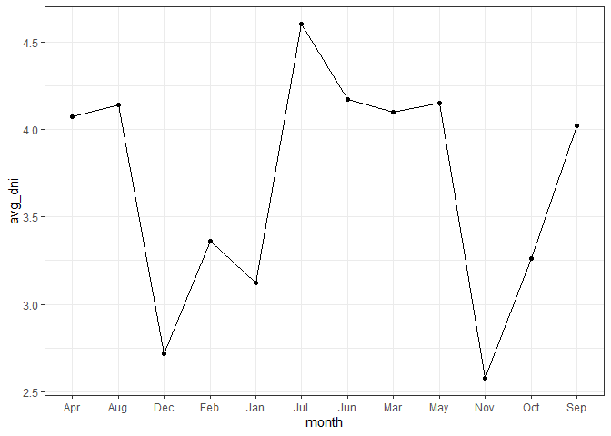
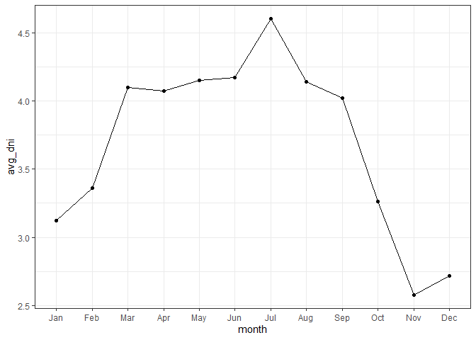

Guided project: new York Solar Irradiance
================
Fredrick Boshe
13/04/2021

# Solar Irradiance, NYC: An APi Guided Project

Accessing data from the US government using their [Data Gov
API](https://developer.nrel.gov/docs/solar/solar-resource-v1/#request-url)
to access, extract and manupulate the Solar data for **New York City**.

**The goal:** To extract the solar resource data for New York City in
JSON format and convert it into a dataframe.

``` r
#Set API url to fetch data
url<-"https://developer.nrel.gov/api/solar/solar_resource/v1"
parameters_list<-list(format="json", api_key=key, lat=41, lon=-75)

#fetch data
response<-GET(url,query=parameters_list)
status<-status_code(response)
status
```

    ## [1] 200

``` r
solar<-content(response,"text")
solar<-fromJSON(solar)

#We get a complex list, but we are only interested in the avg_dni, avg_ghi and avg_lat_tilt
solar_dni_list<-solar$outputs$avg_dni$monthly
solar_ghi_list<-solar$outputs$avg_ghi$monthly
solar_lat_list<-solar$outputs$avg_lat_tilt$monthly


month<-rep(month.abb, 1) #To create a list of months
solar.df<-tibble("month"=month, "avg_dni"=solar_dni_list, 
                 "avg_ghi"=solar_ghi_list, "avg_lat_tilt"=solar_lat_list)

#Some columns are still lists. Convert to numeric
solar.df$avg_dni<-as.numeric(solar.df$avg_dni)
solar.df$avg_ghi<-as.numeric(solar.df$avg_ghi)
solar.df$avg_lat_tilt<-as.numeric(solar.df$avg_lat_tilt)

###Alternatively we can extract with matrix
solar_list<-solar$outputs
solar_unlisted<-unlist(solar_list)

# Convert into Matrix (including the annual value)
solar_matrix <- matrix(data = solar_unlisted, nrow = 13)

# remove the first row wich contains annual values
solar_matrix <- solar_matrix[-1, ]

#Convert to dataframe
solar.df<-data.frame(solar_matrix)

#This methods gives us numeric columns, but still without the Month column
month<-rep(month.abb, 1) #To create a list of months
solar.df<-solar.df%>%
  rename(avg_dni=X1)%>%
  rename(avg_ghi=X2)%>%
  rename(avg_lat_tilt=X3)

solar.df<-cbind(month,solar.df)

#Visualize Irridiance by month
solar.df%>%ggplot(aes(x=month, y=avg_dni, group=1))+
  geom_point()+
  geom_line()+
  theme_bw()
```

<!-- -->

``` r
#Visualize with sorted month/proper order
solar.df <- solar.df %>% 
  mutate(month = factor(month, levels = month.abb))

solar.df%>%ggplot(aes(x=month, y=avg_dni, group=1))+
  geom_point()+
  geom_line()+
  theme_bw()
```

<!-- -->
